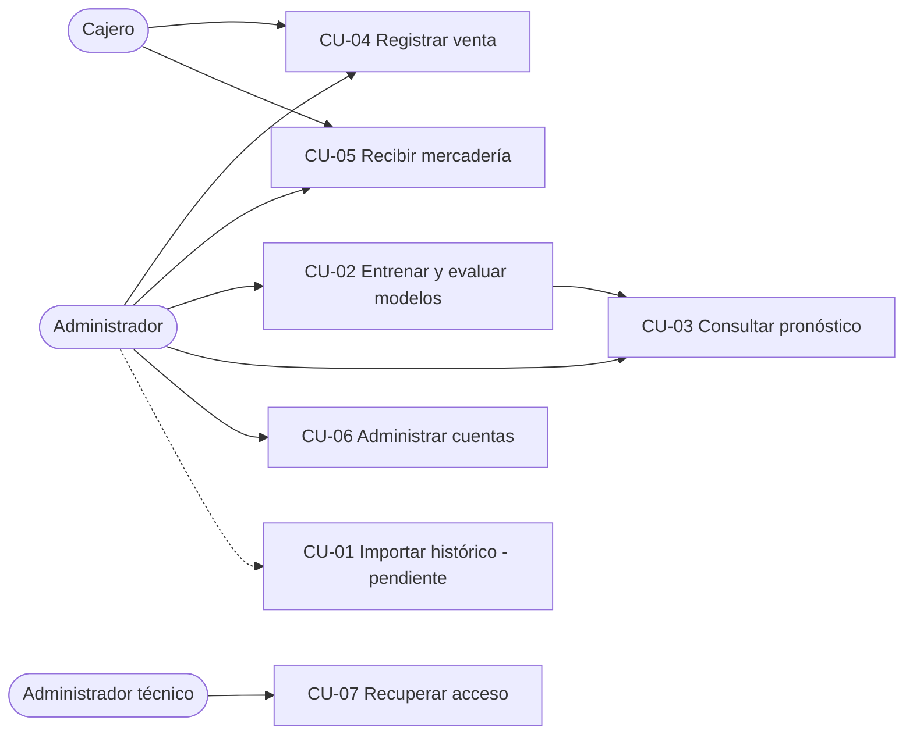
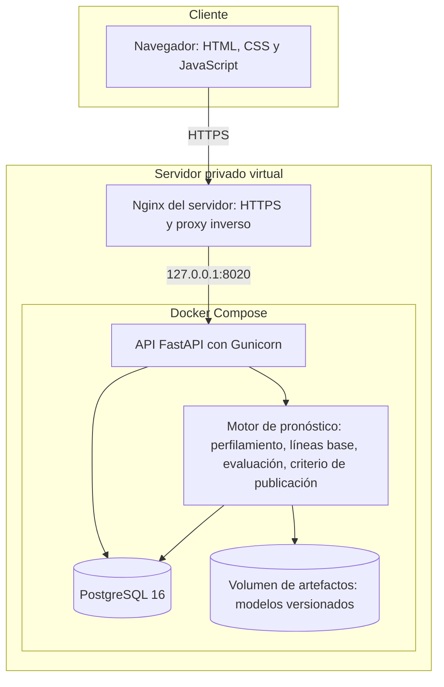
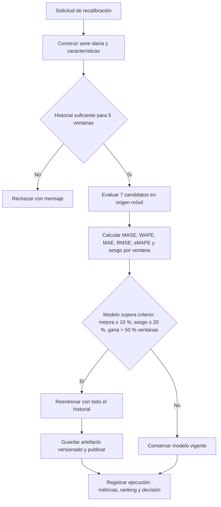

# Capítulo VI – Desarrollo de la Solución Tecnológica

Este capítulo documenta la construcción de la solución: el tipo de sistema, sus requerimientos, su diseño, la forma en que se implementó y cómo se probó. Integra y actualiza la documentación técnica preliminar de la sección 3.5, elaborada antes de construir el sistema. Donde el diseño final difiere del preliminar se indica la diferencia y su justificación, de modo que la documentación describa el sistema que existe y no el que se propuso.

## 6.1 Tipo de sistema propuesto

Siguiendo la taxonomía de Laudon y Laudon (2020), la solución combina cuatro tipos de sistema de información (Tabla 34). No se trata de una clasificación nominal: cada tipo justifica una decisión de arquitectura.

| Tipo | Componente del sistema | Justificación |
|---|---|---|
| Transaccional (TPS) | Registro de ventas, recepción de mercadería, catálogo, movimientos de inventario | Procesa las operaciones diarias y mantiene la existencia de cada producto en la base de datos |
| De soporte a decisiones (DSS) | Pronóstico de ventas, señales por producto, punto de reorden y recomendaciones de reabastecimiento | Apoya la decisión de cuánto y cuándo pedir; no la ejecuta |
| Inteligente (con aprendizaje automático) | Motor de pronóstico con árboles potenciados por gradiente, comparado contra seis métodos de referencia y sujeto a un criterio de publicación | Aprende de los datos y su desempeño se mide y condiciona su uso; no es un conjunto de reglas fijas |
| Web en la nube | Aplicación accesible por navegador, desplegada en contenedores sobre un servidor privado virtual con HTTPS | Permite el acceso desde cualquier sucursal sin instalación local |

Tabla 34. Clasificación del sistema según su tipo. Fuente: Elaboración propia a partir de Laudon y Laudon (2020).

La combinación TPS-DSS explica la arquitectura en capas de la sección 6.3.1: la capa transaccional alimenta con datos al motor de pronóstico, y este devuelve información prospectiva a la misma interfaz. La calificación de sistema inteligente se sostiene en que el componente de aprendizaje automático se evalúa contra líneas base y solo se publica si las supera (sección 6.3.4), en lugar de aplicarse de forma incondicional.

## 6.2 Análisis de requerimientos

### 6.2.1 Fuentes y método

Los requerimientos provienen de tres fuentes: el planteamiento del problema y los objetivos del Capítulo I; el backlog preliminar de la sección 3.5, elaborado con la escala MoSCoW; y la auditoría de alineación entre el documento y el sistema realizada al inicio de la fase, que contrastó cada requerimiento con el código. Se redactaron de forma numerada y verificable, conforme a la norma ISO/IEC/IEEE 29148 (International Organization for Standardization, 2018), y los no funcionales se asociaron a las características de calidad de la norma ISO/IEC 25010 (International Organization for Standardization, 2011). A cada requerimiento se le añade su estado en el MVP, lo que permite trazarlo hacia las pruebas de la sección 6.5.

### 6.2.2 Requerimientos funcionales

| ID | Requerimiento | Prioridad | Estado en el MVP |
|---|---|---|---|
| RF-01 | Iniciar y cerrar sesión con control de acceso por rol | Debe | Implementado con dos roles (administrador y cajero); el rol de analista del diseño preliminar se incorporará junto con el importador de datos, que es la función que lo distingue |
| RF-02 | Registrar y consultar el catálogo de productos, categorías, sucursales y canales | Debe | Parcial: productos y categorías; sucursales pendientes |
| RF-03 | Importar ventas históricas desde archivos CSV o XLSX | Debe | Pendiente; prioridad para la fase de prueba piloto |
| RF-04 | Validar esquema, nulos, duplicados y claves antes de confirmar una carga | Debe | Pendiente, depende de RF-03 |
| RF-05 | Conservar la trazabilidad de cada carga | Debe | Pendiente, depende de RF-03 |
| RF-06 | Perfilar cada serie: cobertura, proporción de ceros, intervalo entre demandas, variabilidad | Debe | Implementado (clasificación de Syntetos, Boylan y Croston) |
| RF-07 | Entrenar líneas base y modelos candidatos con parámetros versionados | Debe | Implementado: seis referencias y un modelo de aprendizaje automático |
| RF-08 | Evaluar con validación temporal de origen móvil y comparar contra la línea base | Debe | Implementado: cinco ventanas, seis métricas |
| RF-09 | Publicar solo la versión aprobada y conservar la anterior | Debe | Implementado: criterio automático de aceptación y artefactos versionados |
| RF-10 | Consultar pronósticos a 7, 14 y 30 días | Debe | Parcial: horizontes de 7, 30, 90 y 180 días sobre el total diario; falta 14 y el nivel por producto |
| RF-11 | Mostrar rango de incertidumbre | Debería | Parcial: intervalo fijo, no derivado del modelo |
| RF-12 | Presentar factores principales y versión del modelo | Debería | Parcial: versión y métricas; sin factores explicativos |
| RF-13 | Alertas de demanda alta, baja rotación y datos desactualizados | Debería | Parcial: alta y baja demanda; falta la alerta de datos desactualizados |
| RF-14 | Simular escenarios de promoción o precio | Podría | Pendiente |
| RF-15 | Exportar pronósticos, métricas y alertas | Debe | Pendiente |
| RF-16 | Comparar pronóstico con venta real y detectar degradación | Debe | Pendiente |
| RF-17 | Registrar en bitácora cargas, entrenamientos, aprobaciones y fallos | Debe | Parcial: los entrenamientos y sus decisiones se registran; la bitácora general está definida y sin uso |
| RF-18 | Exponer endpoints seguros para integración futura con punto de venta | Podría | Parcial: API REST con autenticación por token |
| RF-19 | Administrar cuentas: alta, cambio de rol, activación y restablecimiento de contraseña, con política de contraseñas | Debe | Implementado, con protección contra dejar el sistema sin administrador |
| RF-20 | Registrar ventas con varios productos por ticket, descontando existencia, y registrar recepciones de mercadería | Debe | Implementado |
| RF-21 | Calcular el punto de reorden por producto considerando el lead time de importación y los eventos de temporada | Debe | Implementado sobre la demanda reciente; su vínculo con el modelo de pronóstico es una mejora prevista |

Tabla 35. Requerimientos funcionales con su estado en el MVP. Fuente: Elaboración propia.

Los requerimientos RF-19 a RF-21 no figuraban en el backlog preliminar y surgieron durante la construcción: el primero, de la necesidad de eliminar toda credencial del código y la configuración; los otros dos, de que la empresa no dispone de un sistema transaccional del cual importar, lo que obligó a que el MVP capture las ventas por sí mismo.

### 6.2.3 Requerimientos no funcionales

| ID | Característica (ISO/IEC 25010) | Requisito | Criterio de aceptación | Estado en el MVP |
|---|---|---|---|---|
| RNF-01 | Eficiencia de desempeño | Consultas del tablero ágiles | p95 menor de 3 s con la carga piloto | Sin medir bajo carga; el reentrenamiento completo tarda de 3 a 5 s |
| RNF-02 | Fiabilidad – disponibilidad | Servicio disponible en horario operativo | 99 % mensual | Reinicio automático de contenedores y verificación de salud; sin monitoreo de disponibilidad |
| RNF-03 | Seguridad | TLS, control por rol, contraseñas con hash | Pruebas de acceso no autorizado | Implementado: HTTPS, roles verificados en el servidor, bcrypt, política de contraseñas, secretos fuera del código |
| RNF-04 | Seguridad – confidencialidad | Excluir datos personales innecesarios | Inventario de campos aprobado | Implementado: solo nombre y correo de empleados; sin datos de clientes |
| RNF-05 | Usabilidad | Flujos comprensibles sin entrenamiento extenso | 80 % de tareas completadas por usuarios piloto | Pendiente de medición con el cuestionario de la sección 3.3.2 |
| RNF-06 | Usabilidad – accesibilidad | Navegable con teclado y contraste adecuado | Revisión WCAG 2.2 nivel AA | Parcial: enlace de salto, etiquetas, cierre con Esc, regiones dinámicas anunciadas; revisión formal pendiente |
| RNF-07 | Mantenibilidad | Componentes desacoplados y configuración externa | Pruebas, documentación y análisis estático | Implementado: 128 pruebas automatizadas, configuración por variables de entorno, documentación de despliegue |
| RNF-08 | Fiabilidad – reproducibilidad | Cada pronóstico referencia datos y modelo | Ejecución repetible con el mismo artefacto | Parcial: modelos versionados y semilla fija; falta persistir cada pronóstico emitido |
| RNF-09 | Fiabilidad – recuperabilidad | Respaldos automáticos | Restauración ensayada | Parcial: procedimiento manual documentado y ensayado; sin automatizar |
| RNF-10 | Eficiencia – capacidad | Aumentar productos y sucursales sin rediseño | Prueba con el doble del volumen piloto | Sin medir |
| RNF-11 | Mantenibilidad – analizabilidad | Registros estructurados y métricas | Correlación por identificador de ejecución | Parcial: cada entrenamiento se registra con sus métricas; sin registros estructurados de la API |
| RNF-12 | Portabilidad | Despliegue reproducible en contenedores | Arranque documentado en entorno limpio | Implementado: Docker Compose, verificado en local y en el servidor |

Tabla 36. Requerimientos no funcionales, característica de calidad asociada y estado en el MVP. Fuente: Elaboración propia a partir de ISO/IEC 25010.

### 6.2.4 Casos de uso

Dos actores humanos interactúan con el sistema —el cajero y el administrador— y un tercero, el administrador técnico, opera el servidor. La Tabla 37 lista los casos de uso y la Figura 11 los representa.

| Caso de uso | Actor principal | Precondición | Postcondición | Estado |
|---|---|---|---|---|
| CU-01 Importar histórico de ventas | Administrador | Archivo autorizado y catálogo cargado | Datos normalizados con reporte de calidad | Pendiente (RF-03 a RF-05) |
| CU-02 Entrenar y evaluar modelos | Administrador | Al menos 60 días de historial | Modelo publicado si supera el criterio; intento registrado en cualquier caso | Implementado |
| CU-03 Consultar pronóstico | Administrador | Modelo publicado | Pronóstico, señales y recomendaciones en pantalla | Implementado |
| CU-04 Registrar venta | Cajero o administrador | Sesión activa y productos con existencia | Venta registrada, existencia descontada, indicadores actualizados | Implementado |
| CU-05 Recibir mercadería | Cajero o administrador | Producto registrado | Existencia incrementada y movimiento registrado | Implementado |
| CU-06 Administrar cuentas | Administrador | Sesión de administrador | Cuenta creada, rol cambiado, estado actualizado o contraseña restablecida | Implementado |
| CU-07 Recuperar acceso | Administrador técnico | Acceso al servidor | Contraseña restablecida desde la línea de comandos | Implementado |

Tabla 37. Casos de uso del sistema. Fuente: Elaboración propia.



Figura 11. Diagrama de casos de uso del sistema. Fuente: Elaboración propia.

El flujo principal de CU-02, que materializa la sección 2.5 del marco teórico, es el siguiente: el administrador solicita la recalibración; el sistema construye la serie diaria y sus características; entrena y evalúa los siete candidatos en cinco ventanas de origen móvil; calcula las métricas; aplica el criterio de aceptación al modelo de aprendizaje automático frente al naïve estacional; si lo supera, reentrena con todo el historial, guarda el artefacto versionado y lo publica; si no, conserva el modelo vigente. En ambos casos registra la ejecución con sus métricas y la decisión. El flujo alternativo —ningún candidato supera la referencia— es exactamente el previsto en la Tabla 8 del diseño preliminar.

## 6.3 Diseño de la solución

### 6.3.1 Arquitectura

El sistema adopta una arquitectura cliente-servidor en capas (Sommerville, 2016), desplegada en contenedores. La Figura 12 la representa y la Tabla 38 describe cada componente, señalando las diferencias respecto del diseño preliminar (Tabla 10).



Figura 12. Arquitectura desplegada de la solución. Fuente: Elaboración propia.

| Capa | Componente | Tecnología | Diferencia respecto del diseño preliminar |
|---|---|---|---|
| Presentación | Interfaz web de seis módulos | HTML, CSS y JavaScript sin framework, servidos por la propia API | El preliminar proponía React o Vue; se optó por tecnología sin dependencias para reducir la complejidad de construcción y despliegue |
| Aplicación | API REST con autenticación por token y control de roles | FastAPI, Gunicorn con dos procesos de trabajo | Sin cambio |
| Datos | Base de datos relacional | PostgreSQL 16 en contenedor, con volumen persistente | Sin cambio respecto del preliminar; el prototipo intermedio usó MySQL por restricciones de hospedaje que desaparecieron al contar con servidor propio |
| Artefactos | Modelos entrenados | Archivos versionados por fecha en un volumen fuera de la imagen, con escritura atómica | Sin cambio conceptual; se añadió el versionado por nombre |
| Aprendizaje automático | Perfilamiento, seis líneas base, modelo de árboles potenciados, validación de origen móvil, métricas y criterio de publicación | scikit-learn, statsmodels, pandas, NumPy | El preliminar incluía XGBoost y SHAP; se usó el gradient boosting de scikit-learn y la explicabilidad queda pendiente |
| Tareas asíncronas | Cola y planificador | No implementado | El preliminar proponía Celery o RQ con Redis; el entrenamiento se ejecuta en la petición porque tarda segundos con el volumen actual |
| Infraestructura | Proxy inverso y TLS | Nginx del servidor y Let's Encrypt | Sin cambio |
| Observabilidad | Registros y métricas | Verificación de salud y registro de entrenamientos | El preliminar proponía OpenTelemetry y Prometheus; pendiente |

Tabla 38. Componentes de la arquitectura y diferencias respecto del diseño preliminar. Fuente: Elaboración propia.

El servidor aloja otros proyectos, por lo que Nginx no forma parte del stack de contenedores del sistema: el servicio de la API se publica únicamente en la interfaz local del servidor y el Nginx existente lo expone al exterior. Esta decisión evita conflictos de puertos con los demás servicios y es la razón por la que el despliegue documenta reglas estrictas para la configuración compartida.

### 6.3.2 Modelo de datos

La base de datos sigue el diseño preliminar de separar la cabecera de la venta de su detalle, de modo que un ticket admita varios productos (Chen, 1976). La Figura 13 muestra el modelo entidad-relación implementado y la Tabla 39 el estado de cada entidad respecto de la Tabla 11 preliminar.

```mermaid
erDiagram
    USERS ||--o{ SALES : registra
    USERS ||--o{ STOCK_MOVEMENTS : realiza
    SALES ||--|{ SALE_ITEMS : contiene
    PRODUCTS ||--o{ SALE_ITEMS : aparece_en
    PRODUCTS ||--o{ STOCK_MOVEMENTS : afecta
    PRODUCTS ||--o{ PURCHASE_ORDERS : solicita
    MODEL_RUNS ||--o{ FORECASTS : produce
    PRODUCTS ||--o{ FORECASTS : pronostica
    USERS ||--o{ AUDIT_LOG : genera
    USERS { int id PK; string nombre; string email UK; string password_hash; enum rol; bool activo }
    PRODUCTS { int id PK; string sku UK; string nombre; string categoria; float precio; float costo; int stock_actual; int stock_minimo; int lead_time_dias_china; bool activo }
    SALES { int id PK; datetime fecha_hora; int cajero_id FK; string canal; float total; string metodo_pago }
    SALE_ITEMS { int id PK; int sale_id FK; int product_id FK; int cantidad; float precio_unitario }
    STOCK_MOVEMENTS { int id PK; int product_id FK; enum tipo; int cantidad; int usuario_id FK; datetime fecha; string nota }
    PURCHASE_ORDERS { int id PK; int product_id FK; int cantidad; enum estado; datetime fecha }
    MODEL_RUNS { int id PK; string algoritmo; string version; float mase; float wape; datetime fecha; text parametros_json }
    FORECASTS { int id PK; int model_run_id FK; int product_id FK; date fecha_objetivo; float valor; float intervalo_inf; float intervalo_sup }
    AUDIT_LOG { int id PK; int usuario_id FK; string accion; string entidad; int entidad_id; datetime fecha; text detalle }
```

Figura 13. Modelo entidad-relación implementado. Fuente: Elaboración propia.

| Entidad (Tabla 11 preliminar) | Estado | Observación |
|---|---|---|
| users | Implementada | Roles administrador y cajero |
| products | Implementada | Se añadieron existencia, mínimo, costo y lead time; falta marca |
| sales y sale_items | Implementadas | Cabecera y detalle separados; falta el descuento por línea y la referencia a sucursal |
| stores | Pendiente | El canal se registra como texto en la venta; la entidad de sucursal es prerrequisito del pronóstico por ubicación |
| data_loads | Pendiente | Depende del importador (RF-03) |
| model_runs | Implementada | Registra algoritmo, versión, métricas, protocolo de evaluación, ranking de candidatos y decisión de publicación |
| forecasts | Definida, sin uso | Los pronósticos se calculan en cada consulta; su persistencia es prerrequisito del monitoreo (RF-16) |
| actuals | Pendiente | Depende de la persistencia de pronósticos |
| audit_log | Definida, sin uso | Prerrequisito de la bitácora general (RF-17) |
| stock_movements y purchase_orders | Añadidas | No figuraban en el preliminar; soportan la gestión de inventario y el lead time |

Tabla 39. Estado de las entidades del modelo de datos respecto del diseño preliminar. Fuente: Elaboración propia.

El esquema está normalizado hasta la tercera forma normal: las cantidades y precios de cada producto vendido residen en el detalle, el catálogo no repite datos de venta, y los movimientos de existencia son la única fuente de la cual se deriva el inventario. El esquema se crea automáticamente al arrancar, en un proceso previo al inicio de los servidores web para evitar que varios procesos intenten crearlo a la vez; la incorporación de migraciones versionadas es una mejora pendiente.

### 6.3.3 Diseño de la API

La API sigue el estilo REST (Fielding, 2000): recursos identificados por rutas, operaciones expresadas con los métodos HTTP y autenticación sin estado mediante tokens JWT. La Tabla 40 presenta los endpoints implementados y el rol que los autoriza; el control se verifica en el servidor en cada petición, no en la interfaz.

| Método | Ruta | Propósito | Rol |
|---|---|---|---|
| POST | /auth/login | Autenticar y emitir token | Público |
| GET | /auth/me | Consultar la sesión actual | Autenticado |
| PUT | /auth/me/password | Cambiar la propia contraseña, exigiendo la actual | Autenticado |
| GET, POST, PUT, DELETE | /products | Catálogo | Consulta: autenticado; escritura: administrador |
| GET | /products/stock-bajo | Productos bajo el mínimo | Autenticado |
| GET, POST | /sales | Historial y registro de ventas | Autenticado |
| POST | /inventory/receive | Recepción de mercadería | Autenticado |
| POST | /inventory/adjust | Ajuste de existencia | Administrador |
| GET, POST | /inventory/purchase-orders | Pedidos de compra | Administrador |
| GET | /dashboard/summary, /dashboard/trend | Indicadores y tendencia | Autenticado |
| GET | /predictions/forecast?horizonte | Histórico y pronóstico | Administrador |
| GET | /predictions/signals | Señales por producto | Administrador |
| GET | /predictions/recommendations | Recomendaciones de reabastecimiento | Administrador |
| GET | /predictions/series-profile | Perfil de intermitencia por producto | Administrador |
| POST | /predictions/retrain | Evaluar candidatos y publicar si procede | Administrador |
| GET | /predictions/model | Último entrenamiento registrado: algoritmo, métricas y si se publicó | Administrador |
| GET, POST | /users | Cuentas | Administrador |
| PUT | /users/{id}/rol, /users/{id}/estado, /users/{id}/password | Rol, activación y restablecimiento | Administrador |
| GET | /api/health | Verificación de salud | Público |

Tabla 40. Endpoints de la API implementados. Fuente: Elaboración propia.

Respecto de la Tabla 12 preliminar, las rutas no llevan aún el prefijo de versión /api/v1 y faltan los recursos de cargas de datos, calidad de datos, métricas de pronóstico y exportación, todos ellos dependientes del importador. Los recursos de perfilamiento y de cambio de contraseña no estaban previstos y se añadieron.

### 6.3.4 Diseño del motor de pronóstico

El motor materializa las secciones 2.2 a 2.6 del marco teórico. La Tabla 41 resume sus componentes y la Figura 14 el flujo de una recalibración.

| Componente | Diseño | Sección del marco teórico |
|---|---|---|
| Variable objetivo | Total diario de ventas en quetzales (agregado del negocio) | 2.1 y 3.1.1; el nivel por producto es la siguiente iteración por la intermitencia del catálogo |
| Características | Día de la semana, fin de semana, mes (codificado con seno y coseno), día del mes, indicadores de diciembre, Bono 14 y Caravana, rezagos de 1, 7, 14 y 30 días, medias móviles de 7 y 30 días calculadas solo con fechas anteriores | 2.4, Tabla 1 |
| Control de fuga | Todos los rezagos y ventanas se desplazan un periodo, de modo que ninguna característica del día t utiliza información de t o posterior | 2.2 y 2.3 (Bergmeir y Benítez, 2012) |
| Líneas base | Naïve, naïve estacional de periodo 7, media móvil, suavizamiento exponencial simple con ajuste del parámetro, Holt-Winters aditivo y ARIMA(1,1,1) | 2.2.2 (Hyndman y Athanasopoulos, 2021) |
| Modelo candidato | Árboles potenciados por gradiente de scikit-learn, con hiperparámetros fijos y registrados | 2.3.1 |
| Protocolo de evaluación | Origen móvil con cinco ventanas de 30 días; en cada ventana, todos los candidatos se reentrenan con el pasado disponible y predicen el horizonte completo de forma recursiva | 2.5 (Tashman, 2000) |
| Métricas | MASE escalado con el error in-sample del naïve estacional (Hyndman y Koehler, 2006), WAPE, MAE, RMSE, sMAPE y sesgo; las indefinidas se reportan como tales y no como cero | 2.5, Tabla 2 |
| Criterio de publicación | Mejora de MASE de al menos 10 % sobre el naïve estacional, sesgo relativo no mayor de 20 % y victoria en más de la mitad de las ventanas; umbrales configurables sin tocar código | 2.5.1 |
| Versionado | Cada ejecución registra algoritmo, hiperparámetros, protocolo, métricas de todos los candidatos y decisión; el artefacto se guarda con nombre versionado y escritura atómica | 2.7 |
| Perfilamiento previo | Proporción de ceros, ADI y CV² por producto, con clasificación de Syntetos, Boylan y Croston (2005) | 2.2.3 |

Tabla 41. Componentes del motor de pronóstico y su fundamento teórico. Fuente: Elaboración propia.



Figura 14. Flujo de una recalibración del modelo. Fuente: Elaboración propia.

Dos decisiones de diseño merecen justificación explícita. La primera es evaluar con el horizonte de 30 días, que es el que consume el tablero, en lugar de uno más corto: evaluar a siete días y publicar para treinta mediría un problema distinto del que el sistema resuelve. La segunda es reentrenar cada candidato en cada ventana en lugar de entrenar una vez y desplazar el conjunto de prueba; es más costoso, pero es lo que hace que la validación reproduzca el uso real, en el que el modelo se recalibra a medida que llegan datos (Tashman, 2000).

### 6.3.5 Diseño de la interfaz

La interfaz consta de seis módulos, cada uno en una pantalla: acceso, centro de control, ventas, productos e inventario, pronóstico y usuarios. Los wireframes de la sección 3.5 (Figuras 4 a 6) guiaron la estructura: navegación lateral con la opción activa resaltada, indicadores en tarjetas, gráfica que distingue histórico de pronóstico por color y por trazo, y panel lateral de señales y recomendaciones. Respecto de los wireframes, los módulos de importación y de configuración no se construyeron, y el módulo de usuarios, que el preliminar dejaba fuera, se incorporó por el requerimiento RF-19.

El diseño atiende los criterios del RNF-06: enlace para saltar al contenido, etiquetas asociadas a todos los campos, anuncio de los mensajes de estado a los lectores de pantalla, cierre de ventanas emergentes con la tecla Escape, tablas con encabezados declarados y contraste de la paleta revisado, con ajustes pendientes en los mensajes de error. La evaluación formal contra WCAG 2.2 (World Wide Web Consortium, 2023) queda pendiente. Las pantallas se documentan en el manual de usuario, versión 0.2, y se muestran como evidencia en la sección 6.4.5.

### 6.3.6 Diseño de seguridad

En cumplimiento del RNF-03, la autenticación emite tokens JWT firmados con una clave que solo existe en la configuración del servidor; en el despliegue en contenedores el sistema se niega a arrancar si no se define. Las contraseñas se almacenan con bcrypt, se exige una longitud mínima de diez caracteres con letras y números, y cambiar la propia contraseña requiere conocer la actual. La autorización se verifica en el servidor en cada endpoint; la ocultación de opciones en la interfaz es solo una comodidad. Toda salida de datos del servidor se escapa antes de insertarse en la página, lo que cierra la vía de inyección de código en el navegador. El sistema impide que el último administrador activo pierda su rol o se desactive, y ofrece una vía de recuperación por línea de comandos en el servidor. Las cuentas de demostración se crean con contraseñas aleatorias que se muestran una única vez.

## 6.4 Desarrollo o implementación

### 6.4.1 Tecnologías y justificación

| Componente | Tecnología | Justificación |
|---|---|---|
| Lenguaje del servidor | Python 3.12 | Ecosistema de aprendizaje automático y series temporales; competencia del equipo |
| Framework de API | FastAPI | Validación automática de entradas con Pydantic, documentación interactiva generada, rendimiento asíncrono |
| Acceso a datos | SQLAlchemy | Abstracción del motor de base de datos, que permitió pasar de SQLite en desarrollo a PostgreSQL en producción sin cambios de código |
| Base de datos | PostgreSQL 16 | Motor especificado en el diseño preliminar; tipos enumerados, integridad referencial y madurez |
| Aprendizaje automático | scikit-learn, statsmodels | Implementaciones de referencia para árboles potenciados y para los métodos clásicos de series temporales, lo que evita errores en las líneas base |
| Interfaz | HTML, CSS y JavaScript, Chart.js | Sin proceso de compilación ni dependencias de framework; se sirve desde la misma API |
| Contenedores | Docker Compose | Reproducibilidad del despliegue (RNF-12) y paridad entre desarrollo y producción (Merkel, 2014) |
| Servidor web | Gunicorn con Uvicorn, Nginx | Procesos de trabajo controlados y proxy inverso con TLS |
| Pruebas | pytest | Suite de 128 pruebas ejecutable en segundos |
| Control de versiones | Git y GitHub | Historial verificable, ramas por cambio y revisión mediante pull requests |

Tabla 42. Tecnologías utilizadas y su justificación. Fuente: Elaboración propia.

### 6.4.2 Proceso de construcción

El desarrollo siguió un proceso iterativo en el que cada cambio lógico se construyó en una rama, se acompañó de sus pruebas, se documentó en un pull request y se integró tras revisión, para desplegarse después con un comando reproducible. La Tabla 43 resume las iteraciones de la fase, cada una verificable en el historial del repositorio.

| Iteración | Contenido | Resultado verificable |
|---|---|---|
| 1 | Auditoría de alineación entre el documento y el código | Informe con el estado de cada requerimiento y defectos detectados |
| 2 | Corrección de cuatro defectos críticos: ventanas modales visibles de forma permanente, inyección de código en la interfaz, cálculo erróneo de días hasta el próximo evento y horizonte sin validar | Defectos cerrados con verificación reproducible |
| 3 | Contenerización con Docker Compose y migración a PostgreSQL; corrección de una condición de carrera en la creación del esquema | Despliegue reproducido en local y en el servidor |
| 4 | Documentación de estado y despliegue para el equipo | Guía de despliegue y estado del proyecto |
| 5 | Perfilamiento de series con clasificación de intermitencia | Endpoint y 20 pruebas |
| 6 | Marco de evaluación honesto: seis líneas base, validación de origen móvil, métricas corregidas y criterio de publicación | 51 pruebas; ranking de candidatos registrado en cada ejecución |
| 7 | Administración de usuarios, roles y contraseñas; eliminación de credenciales del código y de la pantalla de acceso | 27 pruebas; cuentas gestionadas desde la base de datos |
| 8 | Rediseño de la interfaz y mejoras de accesibilidad | Seis módulos con navegación, tema y registro de ventas renovados |
| 9 | Simulador de ventas sin funciones compartidas con el modelo | 30 pruebas; validación técnica con demanda censurada |
| 10 | Manual de usuario y guía de demostración | Documentos versionados en el repositorio |

Tabla 43. Iteraciones del desarrollo durante la fase. Fuente: Elaboración propia a partir del historial del repositorio.

### 6.4.3 Entorno de desarrollo y despliegue

El entorno de desarrollo utiliza un entorno virtual de Python con las mismas versiones fijadas que la imagen de producción, una base SQLite para iteración rápida y Docker Compose con PostgreSQL para reproducir exactamente el entorno del servidor. El despliegue en producción consiste en actualizar el repositorio en el servidor y reconstruir los contenedores; la base de datos y los modelos entrenados residen en volúmenes que sobreviven a cada reconstrucción, lo que se verificó destruyendo y recreando el contenedor de la aplicación y comprobando que el modelo publicado conservaba su suma de verificación. La configuración sensible —clave de firma de tokens, credenciales de la base de datos— se inyecta por variables de entorno y nunca forma parte de la imagen ni del repositorio.

### 6.4.4 Evidencia del sistema en funcionamiento

El sistema se encuentra desplegado y accesible con certificado TLS válido. Las Figuras 15 a 20 muestran los seis módulos en operación.

Figura 15. Pantalla de acceso. Fuente: Captura del sistema en producción. [Insertar captura]

Figura 16. Centro de control con indicadores, proyección del próximo mes y ventas reales frente a proyectadas. Fuente: Captura del sistema en producción. [Insertar captura]

Figura 17. Registro de ventas con el formulario de nueva venta. Fuente: Captura del sistema en producción. [Insertar captura]

Figura 18. Productos e inventario con el filtro de existencia baja. Fuente: Captura del sistema en producción. [Insertar captura]

Figura 19. Pronóstico de ventas con señales por producto, recomendaciones de reabastecimiento y resultado de la recalibración. Fuente: Captura del sistema en producción. [Insertar captura]

Figura 20. Administración de usuarios y roles. Fuente: Captura del sistema en producción. [Insertar captura]

## 6.5 Plan de pruebas

### 6.5.1 Estrategia

La estrategia combina cuatro niveles, conforme a la norma ISO/IEC/IEEE 29119 (International Organization for Standardization, 2022b): pruebas unitarias automatizadas de la lógica de negocio y del motor de pronóstico; pruebas de integración automatizadas de la API sobre una base de datos aislada; pruebas funcionales del sistema completo en el entorno de producción; y pruebas no funcionales de seguridad, rendimiento y persistencia. Todas las pruebas automatizadas se ejecutan antes de integrar cualquier cambio. Un principio guió la suite del motor de pronóstico: los valores esperados de cada métrica se calcularon a mano en la propia prueba, no a partir del código que se está probando, porque una fórmula comparada consigo misma pasa la prueba aunque esté equivocada. Ese principio permitió detectar que el cálculo original del MASE no correspondía a la definición de Hyndman y Koehler (2006).

### 6.5.2 Matriz de casos de prueba

| ID | Requerimiento | Resultado esperado | Tipo | Estado |
|---|---|---|---|---|
| CP-01 | RF-01 | Sin token la API responde 401; con rol de cajero, los recursos de administrador responden 403 | Integración | Aprobado |
| CP-02 | RF-19 | Una contraseña de menos de diez caracteres, sin letras o sin números, se rechaza con el motivo | Integración | Aprobado |
| CP-03 | RF-19 | La contraseña se almacena como hash bcrypt y nunca aparece en una respuesta | Integración | Aprobado |
| CP-04 | RF-19 | No es posible desactivar la propia cuenta, quitarse el rol de administrador ni degradar al último administrador activo | Integración | Aprobado |
| CP-05 | RF-19 | Un usuario desactivado no puede iniciar sesión; tras restablecer una contraseña, la anterior deja de funcionar | Integración | Aprobado |
| CP-06 | RF-20 | Registrar una venta descuenta la existencia y rechaza vender más unidades de las disponibles | Funcional en producción | Aprobado |
| CP-07 | RF-06 | Los estadísticos de intermitencia coinciden con valores calculados a mano y la clasificación respeta los cortes de Syntetos, Boylan y Croston | Unitaria | Aprobado |
| CP-08 | RF-06 | El relleno de días sin venta arranca en la primera venta de cada producto, no en el inicio del catálogo | Unitaria | Aprobado |
| CP-09 | RF-08 | MASE, WAPE, MAE, RMSE, sMAPE y sesgo coinciden con valores calculados a mano; las métricas indefinidas devuelven "indefinido", no cero | Unitaria | Aprobado |
| CP-10 | RF-08 | El MASE se escala con el error del conjunto de entrenamiento y no cambia al cambiar el conjunto de prueba | Unitaria | Aprobado |
| CP-11 | RF-08 | En la validación de origen móvil el pronosticador nunca recibe datos posteriores al corte | Unitaria | Aprobado |
| CP-12 | RF-07 | Cada línea base devuelve el horizonte solicitado y valores coherentes en casos calculados a mano | Unitaria | Aprobado |
| CP-13 | RF-09 | Con un umbral imposible el modelo no se publica, el artefacto vigente conserva su suma de verificación y el intento queda registrado | Funcional | Aprobado |
| CP-14 | RF-09 | Los umbrales del criterio se leen de la configuración en tiempo de ejecución | Unitaria | Aprobado |
| CP-15 | RF-10 | Un horizonte fuera del rango permitido responde 422 | Integración | Aprobado |
| CP-16 | RF-21 | Durante un evento de temporada, los días hasta el evento son cero y el refuerzo de reabastecimiento se aplica | Unitaria | Aprobado |
| CP-17 | RNF-03 | La interfaz escapa los datos del servidor; un nombre de producto con etiquetas HTML no ejecuta código | Funcional | Aprobado |
| CP-18 | RNF-12 | El sistema arranca desde cero en contenedores con base de datos vacía sin errores | Funcional | Aprobado |
| CP-19 | RNF-08 | Tras recrear el contenedor, el modelo publicado y los datos se conservan | No funcional | Aprobado |
| CP-20 | RNF-01 | Reentrenamiento completo de siete candidatos en cinco ventanas | No funcional | Aprobado: 3 a 5 s en el servidor |
| CP-21 | RNF-05 | 80 % de tareas completadas por usuarios piloto | Aceptación | Pendiente de la prueba piloto |
| CP-22 | RNF-06 | Revisión WCAG 2.2 nivel AA | No funcional | Pendiente |

Tabla 44. Matriz de casos de prueba trazada a los requerimientos. Fuente: Elaboración propia.

### 6.5.3 Defectos detectados y corregidos

La ejecución del plan detectó defectos que se corrigieron con su prueba de regresión correspondiente (Tabla 45). Se documentan porque evidencian que las pruebas cumplieron su función y porque varios de ellos habrían sido invisibles en el uso normal.

| Defecto | Cómo se detectó | Corrección |
|---|---|---|
| Las ventanas modales eran visibles de forma permanente por una regla de estilo que anulaba el atributo de ocultación | Auditoría de la interfaz | Regla de estilo con prioridad y prueba visual |
| Datos del servidor insertados en la página sin escapar, con posibilidad de robo de sesión | Auditoría de seguridad | Función de escape aplicada en todas las inserciones (CP-17) |
| El cálculo de días hasta el próximo evento devolvía 351 durante el propio evento | Prueba unitaria con nueve casos calculados a mano | Ventanas de evento con valor cero durante el evento (CP-16) |
| El horizonte del pronóstico no tenía límite y permitía bloquear el servidor | Auditoría de la API | Validación del rango (CP-15) |
| Dos procesos creaban el esquema simultáneamente sobre PostgreSQL y uno fallaba | Primer arranque en contenedores con base vacía | Creación del esquema en un proceso previo (CP-18) |
| El MASE se escalaba con el conjunto de prueba en lugar del de entrenamiento | Prueba unitaria contra la definición de Hyndman y Koehler | Escalado in-sample (CP-10) |
| Las métricas indefinidas devolvían cero, lo que se presentaba como error perfecto | Prueba unitaria de casos límite | Valor indefinido explícito (CP-09) |
| Los umbrales de publicación no eran configurables por estar fijados al definir la función | Prueba de la vía de rechazo | Lectura de la configuración en tiempo de llamada (CP-14) |
| La pantalla de acceso mostraba las credenciales de administrador | Búsqueda de credenciales en el repositorio | Eliminadas; contraseñas generadas al azar |
| La pantalla de pronóstico indicaba "Sin entrenar" al abrirse aunque existiera un modelo publicado | Revisión de las capturas para este documento | Consulta del último entrenamiento al cargar la pantalla, con cinco pruebas de la vía |

Tabla 45. Defectos detectados durante las pruebas y su corrección. Fuente: Elaboración propia.

### 6.5.4 Pruebas pendientes

Tres pruebas quedan para la fase de prueba piloto por requerir a la empresa o su volumen real: la prueba de aceptación de usuario con el cuestionario de la sección 3.3.2 (CP-21), la revisión formal de accesibilidad (CP-22) y la medición del percentil 95 de tiempo de respuesta con la carga piloto (RNF-01). Se añadirá, además, la prueba de aceptación del importador de históricos en cuanto se implemente el RF-03, con un archivo real de la empresa como caso de prueba.
